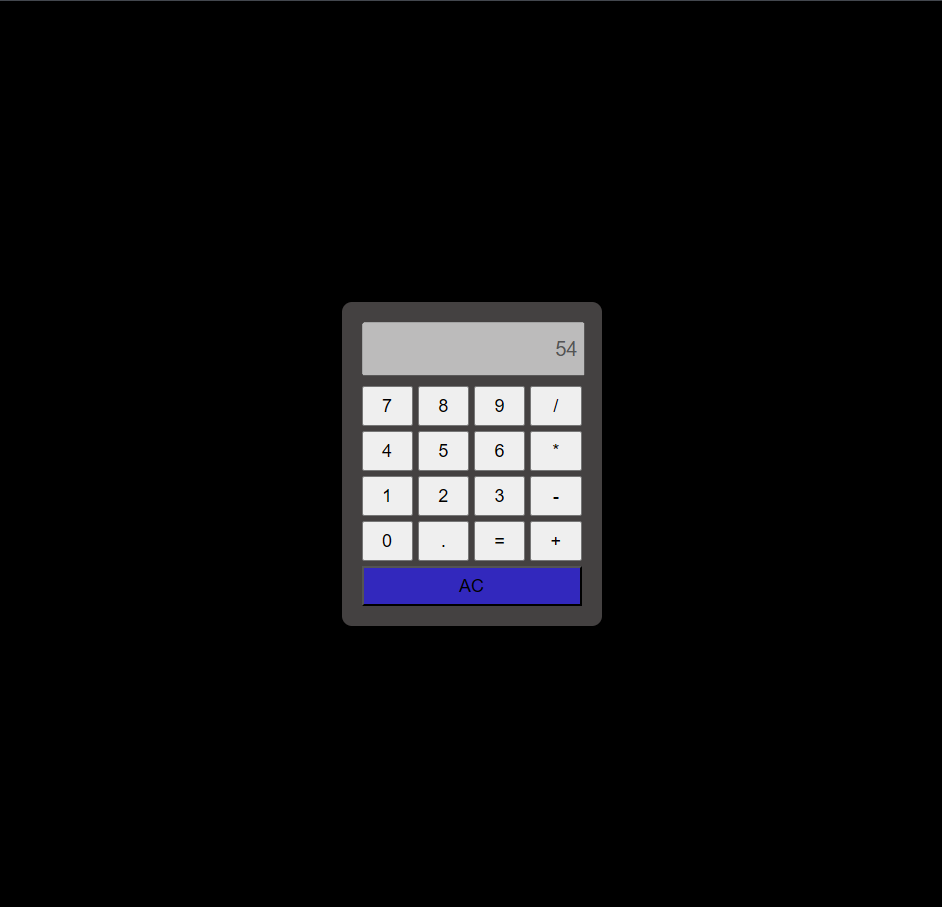

# 🧮 Calculadora Web Interactiva

Una calculadora funcional y moderna desarrollada con tecnologías web estándar. Este proyecto permite realizar las operaciones aritméticas básicas a través de una interfaz limpia y amigable.

## 🚀 Características

* **Operaciones Básicas**: Suma, resta, multiplicación y división.
* **Interfaz Responsiva**: Diseño centrado y adaptado para una visualización clara.
* **Función de Limpieza**: Botón "AC" para borrar la pantalla por completo.
* **Validación de Datos**: Manejo de entradas para asegurar cálculos correctos.

## 🛠️ Tecnologías Utilizadas

* **HTML5**: Estructura semántica del contenido.
* **CSS3**: Estilos personalizados, incluyendo el uso de **CSS Grid** para la disposición de los botones y efectos de sombra.
* **JavaScript (Vanilla)**: Lógica de programación para el procesamiento de expresiones matemáticas.

## 📸 Vista Previa

