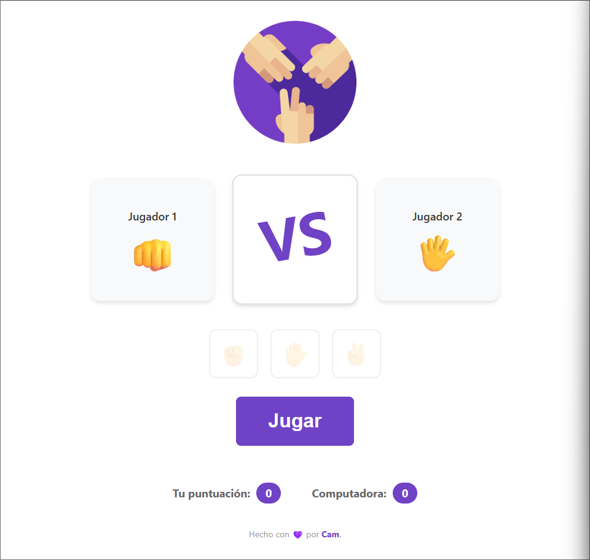

# 🎮 Piedra, Papel o Tijeras
Juego interactivo desarrollado con **HTML, CSS y JavaScript**, donde el usuario compite contra la computadora en el clásico *Piedra, Papel o Tijeras*.

## 🚀 Funcionalidades

- Selección de jugada (piedra, papel o tijeras)
- Generación aleatoria de la jugada de la computadora
- Visualización de resultados en tiempo real (ganar, perder o empatar)
- Sistema de puntuación acumulativa
- Interfaz simple e intuitiva con emojis representativos

## 🧠 Lógica del juego

El sistema compara la elección del jugador con la de la computadora:

- Piedra vence a tijeras  
- Tijeras vence a papel  
- Papel vence a piedra  

## 🛠️ Tecnologías utilizadas

- HTML5  
- CSS3  
- JavaScript (DOM y eventos)  

## 📌 Objetivo del proyecto

Practicar manipulación del DOM, eventos y lógica condicional en JavaScript, desarrollando una aplicación interactiva básica.

## 📷 Vista previa

## ▶️ Cómo usar

1. Presionar el botón **"Jugar"**  
2. Elegir una opción (piedra, papel o tijeras)  
3. Ver el resultado y la actualización del puntaje