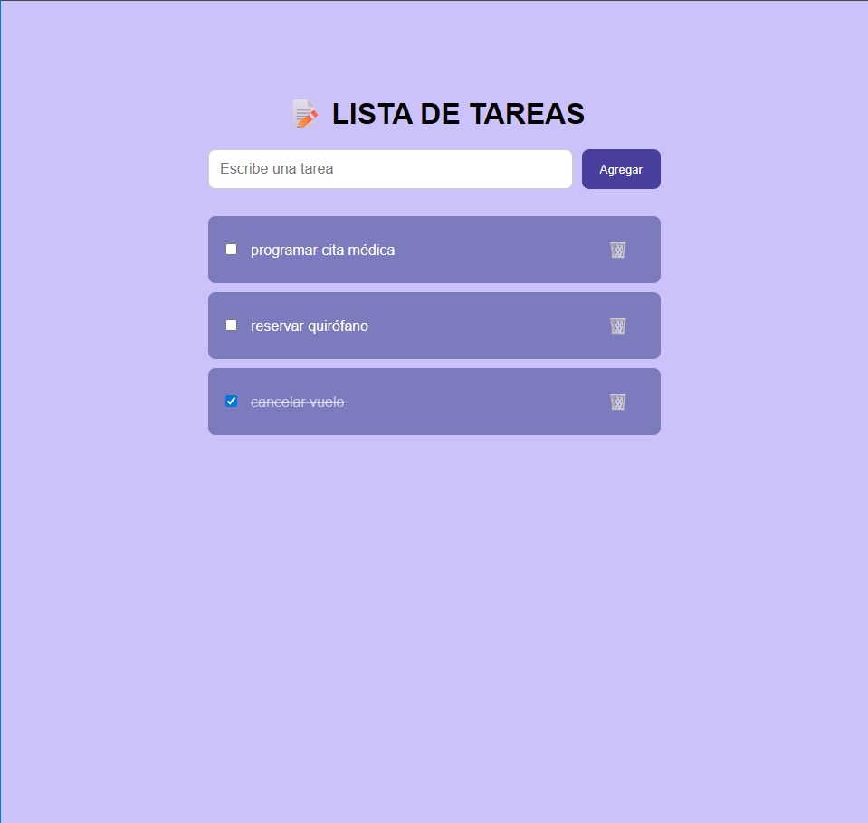

# 📝To-Do List

¡Hola! Este es un proyecto práctico de una **Lista de Tareas** interactiva, desarrollada con **JavaScript**, **HTML5** y **CSS3**. El objetivo principal fue crear una interfaz limpia, simétrica y funcional para gestionar actividades diarias.

## 🚀 Características principales

* **Interfaz Simétrica:** El campo de entrada y los ítems de la lista están perfectamente alineados a un ancho de 500px.
* **Diseño Moderno:** Uso de colores vibrantes (Lila/Violeta) con bordes redondeados y sombras suaves.
* **Acciones rápidas:**
    * Agregar tareas con el botón "Agregar".
    * Marcar tareas como completadas (efecto de tachado).
    * Eliminar tareas de forma individual con el icono de "🗑️".
* **Diseño Responsive:** Adaptable a diferentes tamaños de pantalla gracias al uso de **Flexbox**.

## 🛠️ Tecnologías utilizadas

* **HTML5:** Estructura semántica del documento.
* **CSS3:** Estilos avanzados, Flexbox para alineación y efectos de hover.
* **JavaScript (Vanilla):** Lógica de manipulación del DOM para agregar y quitar elementos.

## 📸 Vista Previa del Diseño
 
 